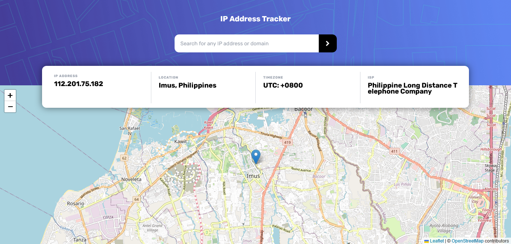
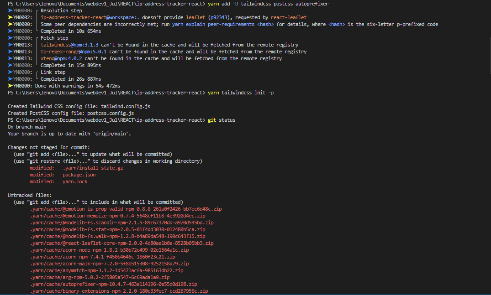
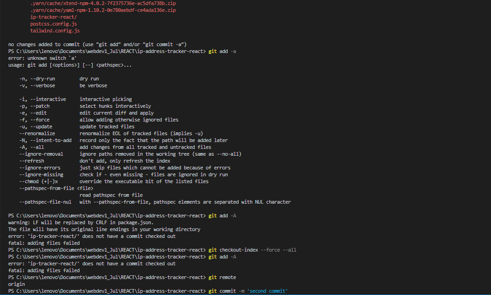
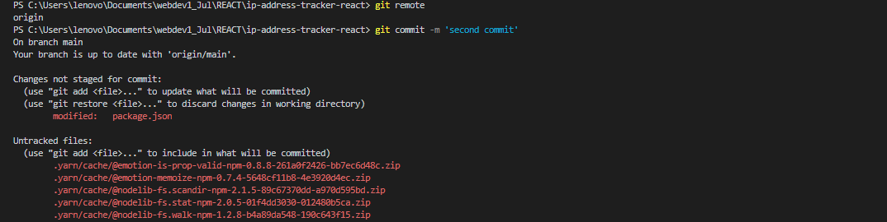
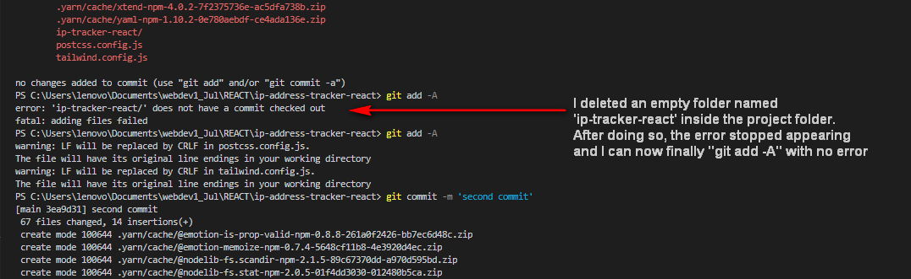

# IP Address Tracker
  A react app that can show you the location, timezone, and the internet service provider of the IP Address that you would like to search using the API provided by [IPAPI](www.ipapi.co). The location will also be shown in the map using the API provided by [LEAFLET](https://leafletjs.com) and the tiles layer is provided by [OpenStreetMap](https://www.openstreetmap.org).
  
## Table of contents

- [Overview](#overview)
  - [Screenshot](#screenshot)
  - [Links](#links)
- [Codesandbox React App](#codesandbox-react-app)
- [ERRORS](#errors)
  - [Error: Does not have a commit checked out](#no-commit-checked-out)
- [Set-up: Tailwind CSS using yarn](#setup-tailwind-css-using-yarn)

## Overview

### Screenshot



### Links

- Live Site URL: [https://taupe-entremet-fdc18e.netlify.app/](https://taupe-entremet-fdc18e.netlify.app/)

## Codesandbox React App

1. Create a new sandbox:
2. Rename the title with an appropriate name.
3. Under **.src folder**, create an `assets` folder and `components` folder.
4. In the `assets` folder, upload all the images from your local machine.
5. In the `components` folder, create the following folders and the corresponding js and css files inside them:
     > - cloud
     >   - Cloud.js
     >   - CloudStyles.css
     > - data
     >   - Data.js
     >   - DataStyles.css
     > - footer
     >   - Footer.js
     >   - FooterStyles.css
     > - hero
     >   - Hero.js
     >   - HeroStyles.css
     > - navbar
     >   - Navbar.js
     >   - NavbarStyles.css

6. Install the following dependencies: 
     - react-icons
     - react-scroll
     - react-router-dom
7. Setting up the **Hamburger menu** for the `<Navbar />` when screen is less than 940px:
     > import `{useState}` from 'react'
     ```js
          import React, {useState} from 'react'
          import {SiDatabricks} from 'react-icons/si'
          import {FaBars} from 'react-icons/fa'
          import {FaTimes} from 'react-icons/fa'
          import './NavbarStyles.css'

          const Navbar = () => {
          const [nav,setNav] = useState(false)
          const handleNav = () => setNav(!nav)

          return (
          <div name='top' className='navbar'>
               <div className='container'>
                    <div className="logo">
                         <SiDatabricks className='icon' />
                         <h1>Secured.</h1>
                    </div>
                    <ul className={nav ? 'nav-menu active' : 'nav-menu'}>
                         <li>Home</li>
                         <li>Recovery</li>
                         <li>Cloud</li>
                         <li>Contact</li>
                         <button>Sign in</button>
                    </ul>
                    <div className="hamburger" onClick={handleNav}>
                         {!nav ? (<FaBars className="icon" />):(<FaTimes className="icon" />)}
                    </div>
               </div>
          </div>
          )
          }

          export default Navbar
     ```

     ```css
          .hamburger {
          display: none;
          padding: 1rem;
          }

          @media screen and (max-width: 940px) {
          .navbar .hamburger {
               display: block;
               z-index: 15;
          }
          .navbar .nav-menu {
               position: absolute;
               flex-direction: column;
               width: 100%;
               height: 100vh;
               top: 0;
               left: -100%;
               align-items: center;
               justify-content: center;
               background: rgba(0, 0, 0, 0.8);
               transition: 0.5s ease-in;
          }
          .navbar .active {
               left: 0;
          }
          .navbar li {
               margin-right: 1rem;
               font-size: 2rem;
          }
          .navbar button {
               font-size: 1.8rem;
          }
          }
     ```

8. Setting up the **SCROLL TO TOP** function inside the `<Footer />` :
    - `import { BsFillArrowUpCircleFill } from 'react-icons/bs'`
       ```js
               const Footer = () => {
               return (
               <div className='footer'>
                    <div className="container">
                         <div className="top">
                              <div className="logo-footer">
                                   <SiDatabricks className='icon' />
                                   <h2>Secured.</h2>
                              </div>
                              <Link activeClass="active" to="top" spy={true} duration={500} >
                                   <BsFillArrowUpCircleFill className='icon' />
                              </Link> 
                         </div>
                         <div className="col-container">
                              <div className="col">
                                   <h3>Navigation</h3>
                                   <p>Home</p>
          ```
    - For the `<BsFillArrowUpCircleFill/>` to lead us to the `<Navbar />`, insert the `name='top'` inside the `<div className='navbar'>` :
          ```js
               return (
                    <div name='top' className='navbar'>
                         <div className='container'>
          ```
9. Put the social media icons by installing `react-icons` and by importing it :
     ```js
          import { SiDatabricks } from 'react-icons/si'
          import { BsFillArrowUpCircleFill } from 'react-icons/bs'
          import { FiMail, FiInstagram, FiFacebook, FiLinkedin, FiTwitter, FiGithub } from 'react-icons/fi'
     ```
     ```js
          <form>
               <h3>Join Our Team</h3>
               <input type="email" placeholder='Enter your email'/>
               <FiMail className='mail-icon' />
               <div className="social-group">
                    <FiInstagram className="social-icon" />
                    <FiTwitter className="social-icon" />
                    <FiFacebook className="social-icon" />
                    <FiLinkedin className="social-icon" />
                    <FiGithub className="social-icon" />
               </div>
          </form> 
     ```
10. Inside the `src` folder, create another folder named `routes`. Inside it, create the following JS pages:
     - RecoveryPage.js
     - CloudPage.js
     - ContactPage.js
11. Inside the `index.js`, to link the pages in our `<Navbar />`, install the `react-router-dom` as dependency and import the following:
     **BE AWARE THAT THE RENDER PROCESS FOR COSESANDBOX IS DIFFERENT FROM WHEN YOU'RE USING VSCODE CREATE-REACT-APP **
     ```js
          import { createRoot } from "react-dom/client";
          import "./styles.css";
          import App from "./App";

          import {BrowserRouter, Routes, Route} from 'react-router-dom';

          import RecoveryPage from './routes/RecoveryPage';
          import CloudPage from './routes/CloudPage';
          import ContactPage from './routes/ContactPage';

          const rootElement = document.getElementById("root");
          const root = createRoot(rootElement);

          root.render(
               <BrowserRouter>
                    <Routes>
                         <Route path='/' element={<App />} />
                         <Route path='/recovery' element={<RecoveryPage />} />
                         <Route path='/cloud' element={<CloudPage />} />
                         <Route path='/contact' element={<ContactPage />} />
                    </Routes>
               </BrowserRouter>
          );
    ```
    
---

### ERROR: DOES NOT HAVE A COMMIT CHECKED OUT





---

## SET-UP: TAILWIND CSS USING YARN

1. Install Tailwind CSS with postcss & autoprefixer:
    > `yarn add -D tailwindcss postcss autoprefixer`
2. Generate tailwind.config.js and postcss.config.js:
    > `yarn tailwindcss init -p`
3. Modify tailwind.config.js file:
    > module.exports = {
    >     content: ["./src/**/*.{js,jsx,ts,tsx}"],
    >     theme: {
    >          extend: {},
    >     },
    >     plugins: [],
    > };

4. Add tailwind base, components and utilities to index.css :
    > @tailwind base;
    > @tailwind components;
    > @tailwind utilities;

---

### Built with

- Semantic HTML5 markup
- CSS custom properties
- Tailwind CSS
- React Router DOM
- ReactJS
- Vite

---
 
## Author

- Twitter - [@julfinch](https://www.twitter.com/julfinch)
